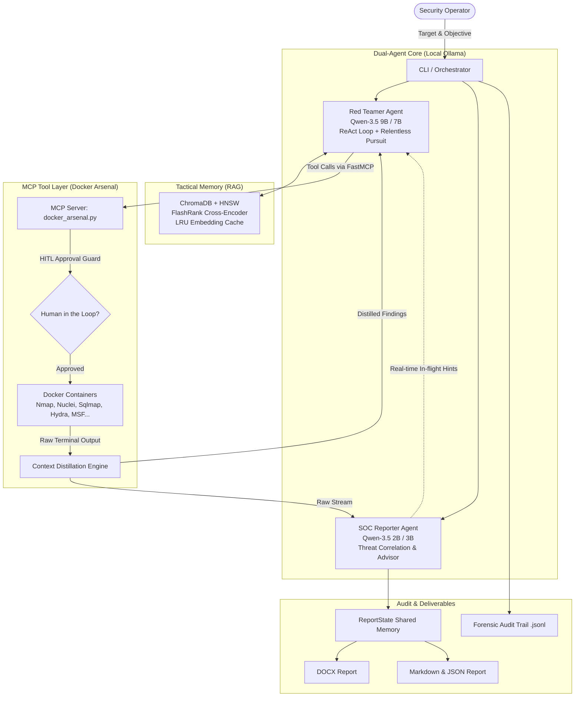

# Autonomous Local MLSecOps Agent

<p align="center">
  <a href="#system-architecture"></a>
  <a href="#model-context-protocol-fastmcp--docker-arsenal"></a>
  <a href="#model-context-protocol-fastmcp--docker-arsenal"></a>
  <a href="#tactical-memory-rag-pipeline"></a>
  
</p>

```
  __  __ _      ____               ___             
 |  \/  | |    / ___| ___  ___   / _ \ _ __  ___  
 | |\/| | |    \___ \/ _ \/ __| | | | | '_ \/ __| 
 | |  | | |___  ___) |  __/ (__  | |_| | |_) \__ \ 
 |_|  |_|_____||____/ \___|\___|\___/| .__/|___/ 
                                      |_|          
```

> **Autonomous Local MLSecOps Agent** is a goal-driven **Autonomous Red Team & SOC Platform** operating **100% locally and offline**. Powered by a collaborative **Dual-Agent Architecture**, the **Model Context Protocol (MCP)**, and **RAG Tactical Memory**, it automates offensive reconnaissance, vulnerability assessment, strategic kill-chain execution, and multi-format reporting without exposing sensitive infrastructure telemetry to external cloud APIs.

---

## Key Innovations & Capabilities

### 1. Dual-Agent Collaborative Loop (Red Team & SOC Synergy)
Unlike standard single-loop LLM agents, this system pairs two specialized local AI models running in real-time synergy:
* **Offensive Red Teamer (Qwen-3.5 9B / 7B)**:
  * Executes a structured **ReAct** (*Reasoning + Acting*) loop to systematically discover, fingerprint, and exploit attack surfaces.
  * **Relentless Pursuit Engine**: Persistent multi-step objective tracking with adaptive fallback plans.
  * **Anti-Stagnation & Auto-Rescue**: Continuously monitors discovery entropy; if the agent gets trapped in repetitive queries, an automated rescue mechanism injects novel tactical vectors.
* **Defensive SOC Reporter (Qwen-3.5 2B / 3B)**:
  * Monitors tool execution output and telemetry stream in real-time.
  * **Compound Threat Correlation**: Automatically evaluates findings against 8 multi-stage exploit chains.
  * **Strategic In-flight Advisor**: Dynamically injects observations and defense-in-depth suggestions into the Red Teamer's active context window.

### 2. Model Context Protocol (FastMCP) & Docker Arsenal (31+ Tools)
Every tool operates in an isolated Docker container via FastMCP stdio interface for maximum security, reproducibility, and OPSEC:
* **Context Distillation Engine**: Raw terminal outputs (which can exceed tens of thousands of lines) are sanitized, distilled, and converted into dense, high-signal JSON/Markdown snippets to preserve token budget.
* **Human-in-the-Loop (HITL) Safety Gate**: Destructive actions (database dumping, brute-force attacks, remote exploit execution) strictly require interactive operator confirmation before dispatch.

| Category | Tools Online | Description |
| :--- | :---: | :--- |
| **Reconnaissance & OSINT** | 23 | `nmap` (fast & deep), `nuclei` (vulnerability & CVE templates), `subfinder`, `ffuf`, `dirb/gobuster`, `nikto`, `whatweb`, `testssl`, `httpx`, `cors`, `sensitive_files`, `waf_detect`, `dns_security_audit`, `ssl_cert_audit`, `security_txt_audit`, `cookie_security_audit`, `http_headers_audit`, `api_docs_audit`, `subdomain_takeover_audit`, `crawler`, `browser` |
| **Exploitation & Cracking** | 8 | `sqlmap` (scan & schema dump), `hydra` (SSH, HTTP login form), `wpscan`, `metasploit` (search & exploit), `bruteforce`, `xss_scanner` |

### 3. Tactical Memory (RAG Pipeline)
An intelligent vector database pipeline ensuring the agent remembers past attack surfaces and tactics:
* **ChromaDB Vector Store** with **HNSW Indexing** for sub-50ms vector queries.
* **Thread-safe LRU Cache (`CachedEmbeddingFunction`)**: Eliminates redundant Ollama/ONNX forward passes, dropping repeated query latency from ~250ms to **<0.01ms**.
* **4-Stage Retrieval Pipeline**:
  $$\text{Target Query} \xrightarrow{\text{Pre-filtering}} \text{Metadata Filters} \xrightarrow{\text{Vector Search}} \text{HNSW Top-K} \xrightarrow{\text{Re-ranking}} \text{FlashRank ONNX (MiniLM-L-12-v2)} \xrightarrow{\text{Cluster}} \text{Tactical Memory}$$

### 4. Automated Multi-Format Reporting & Remediation
Automatically compiles penetration testing engagements into professional deliverables:
* **Interactive HTML Report**: Modern cyber dashboard with real-time CVSS v3.1 / EPSS metrics, CISA KEV badges, and one-click copyable **Actionable Code Snippets** and **Unified Git Diff Patches**.
* **DOCX Report**: Fully formatted report featuring an Executive Summary, Risk Matrix, CVSS v3.1 and CWE classifications, Kill-Chain Timeline, Detailed Findings with severity badges, Prioritized Remediation Roadmaps, and Unified Git Diff Patches.
* **Markdown & JSON Summaries**: Machine-readable assessment summaries for CI/CD integration.
* **Forensic Audit Trail (`.jsonl`)**: Immutable audit logs capturing every prompt, tool execution, payload, and result timestamp for digital forensics and compliance review.

### 5. Frontier Cognitive Architecture (Claude Opus & GPT-5 Astra Tier)
An 8-tier cognitive reasoning pipeline eliminating context truncation amnesia and false positives:
* **Cognitive Scratchpad**: Out-of-band persistent working memory buffer tracking verified facts, active hypotheses, and refuted paths across the entire campaign.
* **Tree of Thought (ToT)**: Attack vector hypothesis tree with autonomous backtracking and dead-end pruning.
* **Skeptic Anti-Hallucination Critic**: Skeptic verification engine filtering out Soft-404s, HTML-escaped XSS reflections, and generic 500 server errors.
* **Dynamic Defense Evasion Engine**: Real-time WAF fingerprinting (Cloudflare, ModSecurity, AWS WAF, 429 rate-limits) and adaptive parameter tampering.
* **Semantic De-obfuscator & Entropy Secret Extractor**: Shannon entropy secret scanner ($H(X) \ge 4.2$) extracting AWS keys, JWT tokens, DB connection strings, and internal RFC 1918 IPs from raw tool responses.
* **Multi-Hop Exploit Chaining**: Automatically chains harvested credentials and tokens into automated SSH and API exploitation branches.
* **Genetic Payload Mutator**: Evolves 6 mutation strategies (comment injection `/**/`, case randomization, double URL encoding `%25`, quote-less `CHAR()`, dialect time substitutions, null-byte bypasses).
* **Multi-Persona Deliberative Cognitive Council**: 4-specialist deliberative peer-review council (Offensive Architect, Cryptographer, OpSec Director, Executive Arbiter).

### 6. Superhuman Autonomous Cyber Operations Engines
Pioneering frontier intelligence engines for high-stakes autonomous cyber operations:
* **Monte Carlo Tree Search (MCTS) Cyber Lookahead Simulator**:
  * Simulates 3-to-5 step future tool outcome trees with rollouts and UCT (Upper Confidence Bound for Trees) scoring.
  * Mathematically optimizes Information Gain vs. OpSec/WAF Detection Risk before dispatching noisy tools.
* **Grammar-Based Business Logic & API Schema Fuzzer**:
  * Parses OpenAPI 3.0, Swagger 2.0, and GraphQL schemas.
  * Synthesizes stateful business logic mutations: **BOLA / IDOR**, **Mass Assignment** (`role: admin`, `isAdmin: true`), **Type Confusion** (32-bit overflow `2147483647`), and **HTTP Verb Tunneling** (`X-HTTP-Method-Override`).
* **Dynamic Defense Fingerprinting & WAF Rule Decompiler**:
  * Pinpoints exact triggering syntax tokens when HTTP 403/406/429 occurs.
  * Reverse-engineers regex filters into specific OWASP CRS Rule IDs (e.g. Rule 942100 SQLi, Rule 941100 XSS, Rule 932100 RCE) and generates token-level evasion matrices.
* **Autonomous Patch Synthesizer & Code-Level Hotfix Sandbox**:
  * Automatically translates confirmed vulnerabilities into production-ready **Unified Git Diff Patches** (`--- a/... +++ b/...`).
  * Runs dry-run sandbox verification validating syntactic integrity, exploit neutralization, and regression freedom.

### 7. Superhuman Cyber Defense & Graph Interdiction Platform
Pioneering full-spectrum automated defense rule synthesis and network kill-chain disruption:
* **Multi-Platform Blue Team Defense Rule Synthesizer**:
  * Translates every discovered vulnerability instantly into 4 production defense formats: **ModSecurity CRS 3.x SecRule**, **Suricata IDS / IPS Signature**, **Sigma SIEM Detection Rule**, and **Cloudflare WAF Expression**.
* **Critical Chokepoint & Attack Path Graph Interdiction Engine**:
  * Evaluates complex multi-hop kill chains on a **Bayesian Attack Graph**.
  * Solves network attack interdiction via edge cut algorithms to pinpoint the top 3 defensive chokepoints and calculate empirical % breach risk reduction.
* **SPA & Dynamic Client-Side State Transition Crawler**:
  * Dissects modern JavaScript frontend bundles (Webpack, Vite, Next.js, React Router).
  * Automatically identifies unlinked client-side routes, audits `localStorage`/`sessionStorage` token leaks, and extracts exposed Firebase/AWS credentials.
* **Autonomous Session State & Resilient Re-Authentication Guardian**:
  * Self-healing session monitoring intercepting HTTP 401 Unauthorized, expired JWT tokens, and login redirection loops.
  * Automatically re-authenticates using harvested credentials or backup tokens, seamlessly propagating valid `Authorization` headers across all subsequent offensive and defensive tools.

### 8. Apex Cyber Deception, Threat Intelligence & Closed-Loop Remediation Platform
Reaching the absolute pinnacle of autonomous cyber capabilities with active counter-deception and empirical proof:
* **Closed-Loop Remediation Verifier & Differential Fuzzing Engine**:
  * Generates 3 classes of test vectors (direct exploit replays, adversarial evasion mutations, and benign baselines).
  * Validates virtual patch rules mathematically ensuring $100\%$ exploit neutralization, high evasion resilience ($\ge 75\%$), and zero false positives ($0.0\%$), issuing certified `APPROVED_FOR_PRODUCTION` verdicts.
* **Autonomous Active Deception & Honey-Token Topology Synthesizer**:
  * Deploys synthetic active defense traps across the target surface: **Canary AWS Access Keys**, **Decoy JWT Tokens**, **Canary Database Connection URIs**, and **Decoy Administrative Route Traps** (`/api/v1/internal/admin-debug`, `/.env.staging.bak`).
  * Generates high-severity tripwire WAF alert rules that trigger instant alarms upon any adversary probing.
* **Autonomous Threat Actor Attribution & MITRE ATT&CK Matrix Profiler**:
  * Maps discovered vulnerabilities and tool actions to **MITRE ATT&CK Enterprise Matrix v14** techniques.
  * Calculates behavioral Jaccard similarity across renowned Advanced Persistent Threat (APT) groups (**APT28 Fancy Bear**, **APT29 Cozy Bear**, **Lazarus Group**, **Volt Typhoon**, **FIN7**).
  * Generates executive **CISO Strategic Briefings** and forecasts the adversary's predicted next lateral movement or exfiltration maneuvers.
* **Autonomous In-Silico Red/Blue Wargame Arena**:
  * Iterative adversarial wargame simulator pitting Red Team mutation attacks against Blue Team virtual patch rules.
  * Automatically applies normalization transforms (`t:urlDecodeUni`, `t:lowercase`) and regex broadening until rules converge to `CONVERGED_IMPREGNABLE` with $100\%$ evasion resilience.

---

## System Architecture



---

## Project Structure

```
├── config.yaml              # Centralized configuration (LLMs, timeouts, HITL, RAG)
├── main.py                  # CLI entrypoint (Interactive & Single-shot modes)
├── setup_wordlists.py       # Automated wordlist downloader (SecLists, RockYou)
├── requirements.txt         # Python dependencies
├── src/
│   ├── client/
│   │   ├── orchestrator.py  # Dual-Agent ReAct engine & Relentless Pursuit logic
│   │   └── report_state.py  # Shared thread-safe finding accumulator & virtual patch rules
│   ├── servers/
│   │   ├── docker_arsenal.py # Primary MCP server (31+ containerized tools)
│   │   ├── nmap_server.py
│   │   ├── nuclei_server.py
│   │   ├── sqlmap_server.py
│   │   ├── hydra_server.py
│   │   └── metasploit_server.py
│   └── utils/
│       ├── config.py           # Configuration parser & pre-flight health checks
│       ├── vector_store.py     # Tactical Memory (RAG) & FlashRank ONNX re-ranking
│       ├── cognitive_scratchpad.py # Persistent out-of-band working memory
│       ├── tree_of_thought.py  # Attack hypothesis tree with backtracking
│       ├── cognitive_critic.py # Anti-hallucination skeptic filter
│       ├── defense_evasion.py  # WAF detection & parameter tampering
│       ├── secret_extractor.py # Shannon entropy scanner & secret extractor
│       ├── exploit_chaining.py # Multi-hop exploit chain synthesizer
│       ├── payload_mutator.py  # Genetic payload mutation engine
│       ├── cognitive_council.py # 4-specialist strategic deliberation council
│       ├── mcts_simulator.py   # Monte Carlo Tree Search lookahead simulator
│       ├── api_logic_fuzzer.py # Grammar-based BOLA & Mass Assignment fuzzer
│       ├── waf_fingerprinter.py # WAF regex rule decompiler & token analyzer
│       ├── patch_sandbox.py    # Unified Git Diff patch synthesizer & sandbox
│       ├── defense_rule_synthesizer.py # Multi-platform ModSec/Suricata/Sigma/Cloudflare rules
│       ├── chokepoint_analyzer.py # Bayesian graph interdiction & cut solver
│       ├── spa_state_crawler.py # Webpack/Vite bundle router & token auditor
│       ├── session_guardian.py # Self-healing auth state & dynamic token rotation
│       ├── remediation_verifier.py # Closed-loop differential fuzzing & patch verifier
│       ├── active_deception_engine.py # Honey-token topology & tripwire rule synthesizer
│       ├── threat_actor_profiler.py # MITRE ATT&CK v14 & APT attribution engine
│       ├── wargame_arena.py    # In-silico Red vs Blue iterative hardening arena
│       ├── html_report_generator.py # Interactive HTML cyber dashboard
│       └── report_generator.py # Multi-format Word (.docx) & JSON report generator
└── tests/                   # 27 comprehensive test suites (476 passing tests, 100% pass rate)
```

---

## Quick Start

### 1. Prerequisites
* **Operating System**: Linux / macOS / Windows (WSL2 or PowerShell)
* **Python**: `3.10+` (Recommended: Python 3.12)
* **Docker Desktop / Docker Daemon**: Running and accessible
* **Ollama**: Running locally (`http://localhost:11434`)
  ```bash
  ollama pull huihui_ai/qwen3.5-abliterated:9b
  ollama pull huihui_ai/qwen3.5-abliterated:2b
  ollama pull nomic-embed-text
  ```

### 2. Installation
```bash
# Clone the repository
git clone https://github.com/nguyenduchuywork23-sudo/Autonomous-MLSecOps-Agent.git
cd Autonomous-MLSecOps-Agent

# Setup virtual environment
python -m venv venv
# Linux / macOS:
source venv/bin/activate
# Windows PowerShell:
.\venv\Scripts\Activate.ps1

# Install dependencies
pip install -r requirements.txt

# Download & initialize wordlists
python setup_wordlists.py
```

### 3. Usage Modes

#### Interactive Terminal Interface
```bash
python main.py
```

#### Headless Single-Shot Reconnaissance
```bash
python main.py --target example.com --mode recon
```

#### Full Autonomous Penetration Test
```bash
python main.py --target 192.168.1.100 --mode full
```

### 4. Running Verification Tests
```bash
pytest tests/ -v
```

---

## Security & Ethical Disclaimer

> [!CAUTION]
> **Authorized Testing Only**: This framework is designed strictly for **authorized penetration testing, red teaming research, defensive security engineering, and academic evaluation**. Performing security assessments against target systems without explicit prior written authorization is unlawful. The authors assume no liability for misuse, unintended side effects, or operational disruption resulting from this software.

---

## Author & Contact

| Field | Details |
| :--- | :--- |
| **Author** | **Nguyen Duc Huy** |
| **GitHub** | [@nguyenduchuywork23-sudo](https://github.com/nguyenduchuywork23-sudo) |
| **Email** | [nguyenduchuywork23@gmail.com](mailto:nguyenduchuywork23@gmail.com) |
