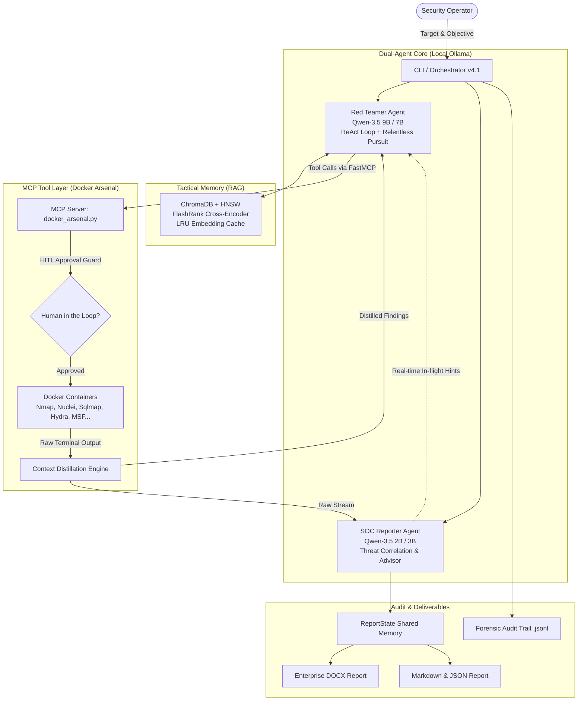

# Autonomous Local MLSecOps Agent v4.1

<p align="center">
  
  
  
  
  
</p>

```
  __  __ _      ____               ___             
 |  \/  | |    / ___| ___  ___   / _ \ _ __  ___  
 | |\/| | |    \___ \/ _ \/ __| | | | | '_ \/ __| 
 | |  | | |___  ___) |  __/ (__  | |_| | |_) \__ \ 
 |_|  |_|_____||____/ \___|\___|\___/| .__/|___/ 
                                      |_|   v4.1   
```

> **Autonomous Local MLSecOps Agent v4.1** is an enterprise-grade, goal-driven **Autonomous Red Team & SOC Platform** operating **100% locally and offline**. Powered by a collaborative **Dual-Agent Architecture**, the **Model Context Protocol (MCP)**, and an **Enterprise RAG Tactical Memory**, it automates offensive reconnaissance, vulnerability assessment, strategic kill-chain execution, and multi-format compliance reporting without exposing sensitive infrastructure telemetry to external cloud APIs.

---

## 🌟 Key Highlights & Innovations

### 1. 🤖 Dual-Agent Collaborative Loop (Red Team & SOC Collaboration)
Unlike standard single-loop LLM agents, this system pairs two specialized local AI models running in real-time synergy:
* **Offensive Red Teamer (Qwen-3.5 9B / 7B)**:
  * Executes a structured **ReAct** (*Reasoning + Acting*) loop to systematically discover, fingerprint, and exploit attack surfaces.
  * **Relentless Pursuit Engine**: Persistent multi-step objective tracking with adaptive fallback plans.
  * **Anti-Stagnation & Auto-Rescue**: Continuously monitors discovery entropy; if the agent gets trapped in repetitive queries, an automated rescue mechanism injects novel tactical vectors.
* **Defensive SOC Reporter (Qwen-3.5 2B / 3B)**:
  * Monitors tool execution output and telemetry stream in real-time.
  * **Compound Threat Correlation**: Automatically evaluates findings against 8 multi-stage exploit chains.
  * **Strategic In-flight Advisor**: Dynamically injects observations and defense-in-depth suggestions into the Red Teamer's active context window.

### 2. 🐳 Model Context Protocol (FastMCP) & Docker Arsenal (31+ Tools)
Every tool operates in an isolated Docker container via FastMCP stdio interface for maximum security, reproducibility, and OPSEC:
* **Context Distillation Engine**: Raw terminal outputs (which can exceed tens of thousands of lines) are sanitized, distilled, and converted into dense, high-signal JSON/Markdown snippets to preserve token budget.
* **Human-in-the-Loop (HITL) Safety Gate**: Destructive actions (database dumping, brute-force attacks, remote exploit execution) strictly require interactive operator confirmation before dispatch.

| Category | Tools Online | Description |
| :--- | :---: | :--- |
| **Reconnaissance & OSINT** | 23 | `nmap` (fast & deep), `nuclei` (vulnerability & CVE templates), `subfinder`, `ffuf`, `dirb/gobuster`, `nikto`, `whatweb`, `testssl`, `httpx`, `cors`, `sensitive_files`, `waf_detect`, `dns_security_audit`, `ssl_cert_audit`, `security_txt_audit`, `cookie_security_audit`, `http_headers_audit`, `api_docs_audit`, `subdomain_takeover_audit`, `crawler`, `browser` |
| **Exploitation & Cracking** | 8 | `sqlmap` (scan & schema dump), `hydra` (SSH, HTTP login form), `wpscan`, `metasploit` (search & exploit), `bruteforce`, `xss_scanner` |

### 3. 🧠 Enterprise RAG Tactical Long-Term Memory
An intelligent vector database pipeline ensuring the agent remembers past attack surfaces and tactics:
* **ChromaDB Vector Store** with **HNSW Indexing** for sub-50ms vector queries.
* **Thread-safe LRU Cache (`CachedEmbeddingFunction`)**: Eliminates redundant Ollama/ONNX forward passes, dropping repeated query latency from ~250ms to **<0.01ms**.
* **4-Stage Retrieval Pipeline**:
  $$\text{Target Query} \xrightarrow{\text{Pre-filtering}} \text{Metadata Filters} \xrightarrow{\text{Vector Search}} \text{HNSW Top-K} \xrightarrow{\text{Re-ranking}} \text{FlashRank ONNX (MiniLM-L-12-v2)} \xrightarrow{\text{Cluster}} \text{Tactical Memory}$$

### 4. 📊 Multi-Format Enterprise Reporting Engine
Automatically compiles penetration testing engagements into professional corporate deliverables:
* **DOCX Report**: Fully formatted corporate report featuring an Executive Summary, Risk Matrix, CVSS v3.1 and CWE classifications, Kill-Chain Timeline, Detailed Findings with severity badges, and Prioritized Remediation Roadmaps.
* **Markdown & JSON Summaries**: Machine-readable assessment summaries for CI/CD integration.
* **Forensic Audit Trail (`.jsonl`)**: Immutable audit logs capturing every prompt, tool execution, payload, and result timestamp for digital forensics and compliance review.

---

## 🏗️ System Architecture



---

## 📂 Project Structure

```
├── config.yaml              # Centralized configuration (LLMs, timeouts, HITL, RAG)
├── main.py                  # CLI entrypoint (Interactive & Single-shot modes)
├── setup_wordlists.py       # Automated wordlist downloader (SecLists, RockYou)
├── requirements.txt         # Python dependencies
├── src/
│   ├── client/
│   │   ├── orchestrator.py  # Dual-Agent ReAct engine & Relentless Pursuit logic
│   │   └── report_state.py  # Shared thread-safe finding accumulator
│   ├── servers/
│   │   ├── docker_arsenal.py # Primary MCP server (31+ containerized tools)
│   │   ├── nmap_server.py
│   │   ├── nuclei_server.py
│   │   ├── sqlmap_server.py
│   │   ├── hydra_server.py
│   │   └── metasploit_server.py
│   └── utils/
│       ├── config.py           # Configuration parser & pre-flight health checks
│       ├── vector_store.py     # Enterprise RAG & FlashRank ONNX re-ranking
│       └── report_generator.py # Multi-format Word (.docx) & JSON report generator
└── tests/                   # 19 comprehensive test suites (E2E, unit & integration)
```

---

## ⚡ Quick Start

### 1. Prerequisites
* **Operating System**: Linux / macOS / Windows (WSL2 or PowerShell)
* **Python**: `3.10+` (Recommended: Python 3.12)
* **Docker Desktop / Docker Daemon**: Running and accessible
* **Ollama**: Running locally (`http://localhost:11434`)
  ```bash
  ollama pull huihui_ai/qwen3.5-abliterated:9b
  ollama pull huihui_ai/qwen3.5-abliterated:2b
  ollama pull nomic-embed-text
  ```

### 2. Installation
```bash
# Clone the repository
git clone https://github.com/nguyenduchuywork23-sudo/Autonomous-MLSecOps-Agent.git
cd Autonomous-MLSecOps-Agent

# Setup virtual environment
python -m venv venv
# Linux / macOS:
source venv/bin/activate
# Windows PowerShell:
.\venv\Scripts\Activate.ps1

# Install dependencies
pip install -r requirements.txt

# Download & initialize wordlists
python setup_wordlists.py
```

### 3. Usage Modes

#### Interactive Terminal Interface
```bash
python main.py
```

#### Headless Single-Shot Reconnaissance
```bash
python main.py --target example.com --mode recon
```

#### Full Autonomous Penetration Test
```bash
python main.py --target 192.168.1.100 --mode full
```

### 4. Running Verification Tests
```bash
pytest tests/ -v
```

---

## 🔒 Security & Ethical Disclaimer

> **IMPORTANT**: This framework is developed strictly for **authorized penetration testing, red teaming research, defensive security engineering, and academic evaluation**. Unauthorized testing against systems without prior written consent from the system owner is illegal and unethical. The authors assume no liability for misuse or damage caused by this software.

---

## 👤 Author
* **Nguyen Duc Huy**
* GitHub: [@nguyenduchuywork23-sudo](https://github.com/nguyenduchuywork23-sudo)
* Email: nguyenduchuywork23@gmail.com
